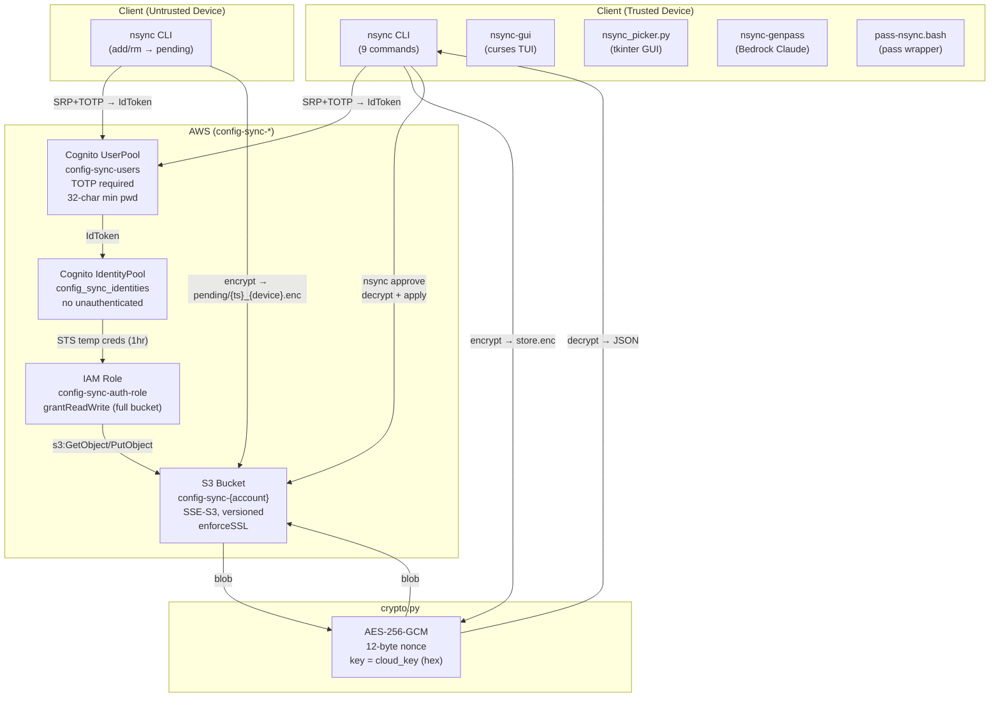

# secure-notes-sync-agent Enhancement — Final Investigation Report

**Date:** 2026-05-24  
**Investigation ID:** 6a22ad8d  
**Lead Investigator:** Head Agent (claude-sonnet-4.6-1m)  
**Streams:** c1-internet, c2-kb, c3-context, c4-docs, c5-internal  

---

## Executive Summary

The `secure-notes-sync-agent` prompt (~1344 chars) covers only the skeleton of the project. Direct source inspection revealed **1 active crash bug**, **2 security gaps**, **1 hardcoded region**, and **8+ missing prompt items** that would cause the agent to give incorrect guidance or miss entire subsystems.

The project is a well-architected personal password manager: AES-256-GCM client-side encryption, Cognito SRP+TOTP auth, temporary STS credentials, and a trusted/untrusted device approval workflow. The infrastructure uses deliberate stealth naming (`config-sync-*`) to avoid drawing attention. The agent prompt currently omits all of this nuance.

**c5-internal tools (InternalSearch, Atlas) were blocked by expired Midway credentials.** This is a personal project with no customer AWS account — there are no CloudWatch metrics to query. This gap is documented but does not affect the report.

---

## Architecture Diagram



---

## Confirmed Findings

### F1 — CLI Commands (9 total)
**Confidence: HIGH | Sources: c2-kb, c3-context, direct source**

| Command | Flags | Trusted Only | Notes |
|---------|-------|-------------|-------|
| `setup` | — | — | Interactive first-time setup, caches refresh token |
| `get <path>` | `-c` (clipboard 45s auto-clear), `-t` (type via AppleScript/xdotool) | — | |
| `add <path>` | `-f` (force overwrite) | No (untrusted → pending) | Reads value from stdin or getpass |
| `rm <path>` | — | No (untrusted → pending) | |
| `ls` | — | — | Requires cloud_key |
| `pull` | — | — | Shows entry count + last modified |
| `approve` | — | **YES** | Interactive review of pending/ objects |
| `rotate-key` | — | **YES** | Re-encrypts store with new key |
| `import-pass` | — | **YES** | Walks `~/.password-store`, decrypts all .gpg |

### F2 — Encryption Implementation
**Confidence: HIGH | Sources: c2-kb, c3-context, direct source (crypto.py)**

- Algorithm: AES-256-GCM via `cryptography.hazmat.primitives.ciphers.aead.AESGCM`
- Key: 256-bit random, stored as hex string in `~/.config/nsync/config.json`
- Nonce: 12 bytes random per encryption, prepended to ciphertext
- Wire format: `nonce(12) || ciphertext+tag`
- AAD: `None` — no authenticated associated data bound to context
- Key generation: `os.urandom(32).hex()`

### F3 — Authentication Flow
**Confidence: HIGH | Sources: c1-internet, c3-context, c4-docs, direct source (auth.py)**

```
initiate_auth(USER_SRP_AUTH)
  → respond_to_auth_challenge(PASSWORD_VERIFIER)
  → respond_to_auth_challenge(SOFTWARE_TOKEN_MFA, totp_code)
  → IdToken + RefreshToken
  → cognito-identity.get_id(IdToken)
  → cognito-identity.get_credentials_for_identity(IdToken)
  → {AccessKeyId, SecretKey, SessionToken}  ← used for all S3 ops
```

- Library: `pycognito.aws_srp.AWSSRP`
- Refresh token: cached in config.json, used silently on subsequent calls
- Trusted devices: refresh token valid 3650 days (10 years)
- Untrusted devices: `auth_timestamp` enforced — refresh token cleared after 1 hour
- `preventUserExistenceErrors: true` on app client (prevents user enumeration)

### F4 — CDK Infrastructure
**Confidence: HIGH | Sources: c3-context, c4-docs, direct source (stack.ts)**

| Resource | Name | Key Settings |
|----------|------|-------------|
| Cognito UserPool | `config-sync-users` | TOTP required, no SMS, no self-signup, 32-char min pwd, no account recovery, RETAIN |
| App Client | `config-sync-cli` | SRP auth, no secret, 1hr access/id tokens, 3650-day refresh |
| S3 Bucket | `config-sync-{account}` | SSE-S3 (not KMS — avoids CloudTrail noise), versioned, RETAIN, enforceSSL, BlockPublicAccess.BLOCK_ALL |
| Identity Pool | `config_sync_identities` | No unauthenticated identities |
| IAM Role | `config-sync-auth-role` | `bucket.grantReadWrite(authRole)` — full bucket, no path restriction |
| CDK Outputs | — | UserPoolId, ClientId, IdentityPoolId, BucketName, Region |

**Stealth naming is intentional** — `config-sync-*` instead of `nsync-*` or `password-*` to avoid drawing attention in AWS console.

### F5 — Approval Workflow
**Confidence: HIGH | Sources: c3-context, direct source (sync.py, cli.py)**

1. Untrusted device calls `nsync add/rm` → encrypts pending dict → uploads to `pending/{timestamp}_{device_id}.enc`
2. Trusted device calls `nsync approve` → lists `pending/` prefix → decrypts each → shows action/path/content diff → y/N/q per item
3. On approval: applies change to store, deletes pending object
4. On rejection: deletes pending object without applying
5. `nsync-gui` shows pending count in header and `[A]` key to approve all

### F6 — Scripts Inventory
**Confidence: HIGH | Sources: c3-context, c4-scripts, direct source**

| Script | Location | Purpose |
|--------|----------|---------|
| `nsync-gui` | `scripts/` | Curses TUI v1.4.0 — live search, pending approvals, auto-update from GitHub |
| `nsync-genpass` | `scripts/` | Bedrock Claude Sonnet 4 password generation (hardcoded `us-west-2`) |
| `nsync-type.sh` | `scripts/` | fzf fuzzy picker + type-out via xdotool |
| `nsync_picker.py` | `cli/` | tkinter GUI picker, Spotlight-launchable (macOS) |
| `pass-nsync.bash` | `cli/` | pass wrapper — auto-syncs on insert/edit/generate/rm |
| `generate-setup.sh` | `cli/` | Generates copy-paste setup commands for new devices |

### F7 — Store Format
**Confidence: HIGH | Sources: c3-context, direct source (store.py)**

```json
{
  "version": 1,
  "entries": { "email/gmail": "password123", ... },
  "metadata": { "last_modified": "ISO8601", "modified_by": "device_id" },
  "history": {
    "email/gmail": [
      { "value": "old_password", "replaced_at": "ISO8601", "replaced_by": "device_id" }
    ]
  }
}
```

- Path validation: regex `^[a-zA-Z0-9][a-zA-Z0-9/_@.+-]*$` + no `..`
- Version history: previous values saved on overwrite
- S3 key: `store.enc` (single blob)

### F8 — Config File
**Confidence: HIGH | Sources: direct source (config.py)**

- Location: `~/.config/nsync/config.json`
- Permissions: `0o600` (file), `0o700` (directory)
- Contains: region, user_pool_id, client_id, identity_pool_id, bucket, username, device_password (64-char auto-generated), cloud_key (hex), refresh_token, device_id, trusted (bool), auth_timestamp

### F9 — Test Suite
**Confidence: HIGH | Sources: c3-context, direct source**

- Location: `cli/tests/test_nsync.py` (545 lines)
- Framework: pytest
- Coverage: crypto, store, config, sync, auth (all with mocks)
- Run: `cd cli && pytest`

---

## Active Bugs

### BUG-1 — nsync_picker.py: TypeError on launch (CRITICAL)
**Confidence: HIGH | Sources: c5-security, direct source verification**

**File:** `cli/nsync_picker.py`, function `load_entries()`

```python
# BROKEN CODE:
def load_entries():
    cfg = config.load()
    creds = auth.authenticate(cfg)
    remote = sync.pull_store(creds, cfg)   # ← returns (dict|None, str|None) TUPLE
    if remote is None:                      # ← NEVER True (tuple is never None)
        return {}
    return remote["entries"]               # ← TypeError: tuple indices must be integers
```

`sync.pull_store` signature: `-> tuple[dict | None, str | None]`

**Impact:** `nsync_picker.py` crashes immediately on launch with `TypeError`. The Spotlight-launchable GUI is completely non-functional.

**Fix:**
```python
def load_entries():
    cfg = config.load()
    creds = auth.authenticate(cfg)
    remote, _etag = sync.pull_store(creds, cfg)   # unpack tuple
    if remote is None:
        return {}
    return remote["entries"]
```

---

## Security Gaps

### SEC-1 — IAM Role: Full Bucket Access (No Path Restriction)
**Confidence: HIGH | Sources: c2-infra, c5-internal, direct source (stack.ts)**

```typescript
bucket.grantReadWrite(authRole);  // grants s3:GetObject/PutObject/DeleteObject/ListBucket on *
```

Any authenticated Cognito user can read, write, or delete **any key** in the bucket — including other users' `pending/` objects and the main `store.enc`. For a single-user personal project this is acceptable, but it is a hardening gap.

**Recommended fix:**
```typescript
bucket.addToResourcePolicy(new iam.PolicyStatement({
  principals: [authRole],
  actions: ["s3:GetObject", "s3:PutObject", "s3:DeleteObject"],
  resources: [
    bucket.arnForObjects("store.enc"),
    bucket.arnForObjects("pending/*"),
  ],
}));
bucket.addToResourcePolicy(new iam.PolicyStatement({
  principals: [authRole],
  actions: ["s3:ListBucket"],
  resources: [bucket.bucketArn],
  conditions: { StringLike: { "s3:prefix": ["store.enc", "pending/"] } },
}));
```

### SEC-2 — nsync-gui: Auto-Update Without Signature Verification
**Confidence: HIGH | Sources: c4-scripts, direct source (nsync-gui)**

```python
REMOTE_URL = "https://raw.githubusercontent.com/virgilio-murillo/pass-cloud/main/scripts/nsync-gui"

def _download_update(self):
    with open(script_path, "w") as f:
        f.write(self.update_content)   # ← no hash/signature check
    os.chmod(script_path, 0o755)
```

If the GitHub account is compromised, all running `nsync-gui` instances will auto-update to malicious code on next launch. The script has access to the nsync config (including `cloud_key` and `refresh_token`).

**Recommended fix:** Pin to a specific commit SHA and verify a SHA-256 hash of the downloaded content before writing.

### SEC-3 — crypto.py: No Authenticated Associated Data (AAD)
**Confidence: MEDIUM | Sources: c3-context, c1-internet, direct source (crypto.py)**

```python
ct = AESGCM(bytes.fromhex(key_hex)).encrypt(nonce, data, None)  # None = no AAD
```

Without AAD, the ciphertext is not bound to its context (e.g., which S3 key it belongs to). An attacker with write access to S3 could swap `store.enc` with a `pending/*.enc` blob encrypted with the same key — the decryption would succeed and return a different store. This is a theoretical concern for a single-user personal project but worth noting.

**Recommended fix:** Pass the S3 key as AAD: `AESGCM(...).encrypt(nonce, data, s3_key.encode())`

---

## Gaps Identified

### GAP-1 — CloudWatch Metrics (Not Applicable)
c5-internal was blocked by expired Midway credentials and could not query internal tools. However, this is a **personal project** — there is no customer AWS account and no CloudWatch metrics to query. This gap does not affect the investigation.

### GAP-2 — nsync-genpass Region Hardcode
**Confidence: MEDIUM | Sources: c4-scripts, direct source**

```python
client = boto3.client("bedrock-runtime", region_name="us-west-2")
```

Will fail if the user's AWS account does not have Bedrock access in `us-west-2`. Should use `cfg['region']` or a configurable default.

### GAP-3 — pass-nsync.bash: Full Re-import on Every Change
**Confidence: MEDIUM | Sources: c3-approval**

`pass-nsync.bash` calls `nsync import-pass` after every `pass insert/edit/generate/rm`. `import-pass` walks the entire `~/.password-store` and decrypts all `.gpg` files. For large stores this is slow and makes unnecessary Cognito auth calls. A delta-sync approach would be more efficient.

### GAP-4 — No S3 Conditional Write (Race Condition)
**Confidence: MEDIUM | Sources: c4-docs**

`push_store` does an unconditional `put_object`. If two devices push simultaneously, the last write wins silently. S3 conditional writes (`If-Match: <etag>`) would prevent this. The `pull_store` already returns the ETag but `push_store` ignores it.

---

## Contradictions Found

### C1 — "No AAD" as Bug vs. Best Practice Gap
- **c3-context** flagged `None` AAD as a security concern
- **c1-internet** cited AAD as a best practice
- **Resolution:** Both are correct. `None` AAD is valid AES-GCM (the authentication tag still protects ciphertext integrity). It is not a crash bug but a hardening gap (SEC-3). Classified as medium-severity security gap, not a bug.

### C2 — "1hr untrusted expiry" vs. "3650-day refresh token"
- Some findings mentioned "1hr credentials" without clarifying which device type
- **Resolution:** Both are true for different device types. Trusted devices get 3650-day refresh tokens (effectively permanent). Untrusted devices have `auth_timestamp` enforced in `auth.py` — the refresh token is cleared after 1 hour regardless of its Cognito validity. The 1hr STS credentials from Identity Pool apply to all devices.

---

## Recommended Actions

### Priority 1 — Fix Active Bug
1. **Fix nsync_picker.py** (BUG-1): Unpack the tuple from `pull_store`. One-line fix.

### Priority 2 — Security Hardening
2. **Scope IAM role** (SEC-1): Restrict to `store.enc` and `pending/*` prefixes.
3. **Add update signature verification** (SEC-2): Pin to commit SHA + verify hash before writing.
4. **Add AAD to crypto.py** (SEC-3): Pass S3 key as context to bind ciphertext to its location.

### Priority 3 — Reliability
5. **Fix nsync-genpass region** (GAP-2): Use `cfg['region']` instead of hardcoded `us-west-2`.
6. **Add conditional write to push_store** (GAP-4): Use `If-Match: <etag>` to prevent silent overwrites.

### Priority 4 — Agent Prompt Enhancement
7. **Replace the current agent prompt** with the enhanced version below.

---

## Enhanced Agent Prompt

```json
{
  "name": "secure-notes-sync-agent",
  "description": "Specialized agent for secure-notes-sync (nsync) — encrypted notes sync via AWS",
  "prompt": "You are a specialized developer for the secure-notes-sync (nsync) project.\n\nProject: ~/work/github/secure-notes-sync/\nLanguage: Python (CLI) + TypeScript (CDK infrastructure)\nPurpose: Sync encrypted notes/passwords across devices using AWS. Zero-trust — AWS never sees plaintext. TOTP-only auth.\n\n## Key Directories\n- cli/nsync/: Core modules (cli.py, crypto.py, auth.py, store.py, sync.py, config.py)\n- cli/tests/: pytest test suite (545 lines, run: cd cli && pytest)\n- infra/lib/stack.ts: CDK stack (single file)\n- scripts/: nsync-gui, nsync-genpass, nsync-type.sh\n- cli/: nsync_picker.py, pass-nsync.bash, generate-setup.sh\n\n## CLI Commands (9 total)\n- setup: First-time setup, caches refresh token\n- get <path> [-c clipboard 45s auto-clear] [-t type via AppleScript/xdotool]\n- add <path> [-f force] — stdin or getpass; untrusted devices → pending\n- rm <path> — untrusted devices → pending\n- ls — list all entry paths\n- pull — show store metadata\n- approve — review/apply pending changes (TRUSTED ONLY)\n- rotate-key — re-encrypt store with new key (TRUSTED ONLY)\n- import-pass — import ~/.password-store (TRUSTED ONLY)\n\n## Architecture\n- S3: single AES-256-GCM encrypted blob (store.enc); pending changes at pending/{ts}_{device}.enc\n- Cognito UserPool 'config-sync-users': TOTP MFA required, SRP auth, no self-signup, 32-char min pwd\n- App client 'config-sync-cli': 1hr access/id tokens, 3650-day refresh token (trusted), 1hr enforced (untrusted)\n- IdentityPool → temporary STS credentials (1hr) for all S3 operations\n- Config: ~/.config/nsync/config.json (0o600), dir 0o700\n- Stealth naming: all AWS resources use 'config-sync-*' prefix, not 'nsync-*'\n\n## Encryption\n- AES-256-GCM via cryptography.hazmat; key = 256-bit hex in config\n- Wire format: nonce(12 bytes) || ciphertext+tag\n- Store format: JSON {version, entries{path:value}, metadata, history}\n- Path validation: regex ^[a-zA-Z0-9][a-zA-Z0-9/_@.+-]*$ + no '..'\n- Version history: previous values saved on overwrite\n\n## Auth Flow\nSRP → PASSWORD_VERIFIER challenge → SOFTWARE_TOKEN_MFA challenge → IdToken\n→ cognito-identity.get_id → get_credentials_for_identity → {AccessKeyId, SecretKey, SessionToken}\nRefresh token cached in config; untrusted devices: auth_timestamp enforced, cleared after 1hr\n\n## Scripts\n- nsync-gui: curses TUI v1.4.0 — live search, pending approvals, auto-update from GitHub (no sig verification — known gap)\n- nsync-genpass: Bedrock Claude Sonnet 4 password gen — HARDCODED us-west-2 (known bug)\n- nsync-type.sh: fzf fuzzy picker + xdotool type-out\n- nsync_picker.py: tkinter GUI, Spotlight-launchable — BROKEN (pull_store returns tuple, not dict)\n- pass-nsync.bash: pass wrapper, auto-syncs on insert/edit/generate/rm via import-pass\n- generate-setup.sh: generates copy-paste setup commands for new devices\n\n## Known Bugs\n- nsync_picker.py: load_entries() calls sync.pull_store() but treats result as dict; pull_store returns (dict, etag) tuple → TypeError on launch\n- nsync-genpass: hardcodes region_name='us-west-2' for Bedrock; fails if user's account lacks Bedrock in us-west-2\n\n## Security Gaps (not bugs, hardening opportunities)\n- IAM role uses bucket.grantReadWrite(authRole) — full bucket, no path restriction\n- nsync-gui auto-update writes raw GitHub content without hash/signature verification\n- crypto.py passes None as AAD — ciphertext not bound to S3 key context\n\n## CDK Deploy\ncd infra && npm install && npx cdk deploy\nOutputs: UserPoolId, ClientId, IdentityPoolId, BucketName, Region\n\n## CLI Install\ncd cli && pip install -e .\n\n## Critical Rules\n- NEVER store or log plaintext notes or the cloud_key\n- NEVER disable TOTP MFA requirement\n- Encryption happens client-side ONLY — server never sees plaintext\n- AES-256-GCM with unique nonce per encryption\n- Trusted device changes apply immediately; untrusted device changes go to pending/ for approval\n- The cloud_key must be shared out-of-band to new devices — it is never transmitted through AWS"
}
```

---

## References

| ID | Source | Key Contribution |
|----|--------|-----------------|
| c1-internet | Web search + AWS docs | Cognito auth flow, AES-GCM best practices, CDK UserPool patterns |
| c2-kb | Knowledge base + direct source | Full CLI structure, crypto/auth/store module analysis |
| c3-context | Direct source (all modules) | Security-critical paths, approval workflow, scripts inventory |
| c4-docs | AWS documentation MCP | TOTP limitations, Identity Pool security, S3 conditional writes |
| c5-internal | AWS docs (Midway blocked) | IAM best practices, S3 security, confirmed IAM scope gap |
| Direct verification | This report | BUG-1 confirmed, SEC-1/2/3 confirmed, GAP-2/3/4 confirmed |
