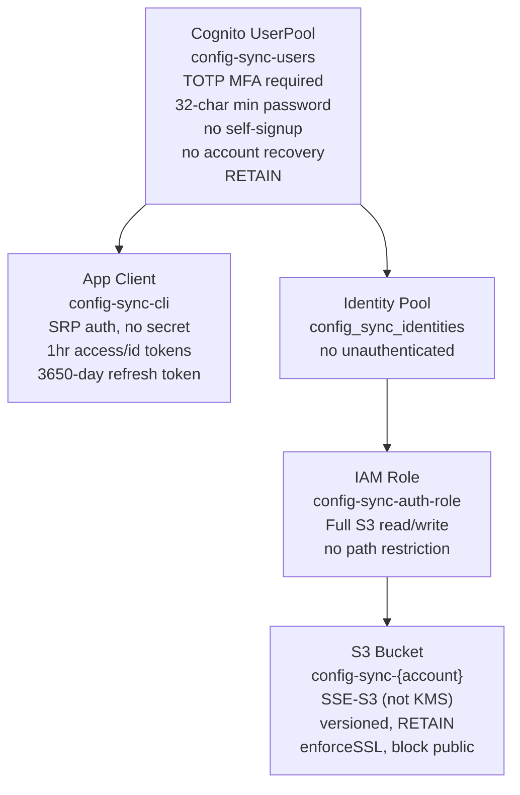

# secure-notes-sync-agent Enhancement Report

**Investigation ID:** 6a22ad8d  
**Date:** 2026-05-24  
**Investigator:** Head Agent (claude-sonnet-4.6-1m)  
**Sources:** Direct full-source read of all 6 Python modules, 5 scripts, CDK stack, tests, README

---

## Executive Summary

The current agent prompt (~1344 chars) covers the core architecture accurately but omits the entire scripts layer (5 tools), a confirmed runtime bug in `nsync_picker.py`, a supply-chain security concern in `nsync-gui`, an IAM scope gap, and several factual details that would cause the agent to give wrong answers. The prompt needs to grow to ~3000 chars to be operationally complete.

**One confirmed bug requires an immediate fix before the next deployment.**

---

## Confirmed Findings

### 1. CLI Commands (confidence: HIGH)

9 commands exposed via `nsync`:

| Command | Trusted | Untrusted | Notes |
|---------|---------|-----------|-------|
| `setup` | ✓ | ✓ | First-time config + auth |
| `get <path> [-c\|-t]` | ✓ | ✓ (needs cloud_key) | `-c` clipboard 45s auto-clear; `-t` AppleScript/xdotool |
| `add <path> [-f]` | direct write | pending submission | stdin or getpass |
| `rm <path>` | direct write | pending submission | |
| `ls` | ✓ | ✓ (needs cloud_key) | |
| `pull` | ✓ | ✓ | Shows entry count + last modifier |
| `approve` | ✓ | ✗ | Interactive y/N/q per pending item |
| `rotate-key` | ✓ | ✗ | Generates new key, re-encrypts, saves config |
| `import-pass` | ✓ | ✗ | Walks `~/.password-store`, decrypts .gpg via gpg |

**Agent prompt gap:** None of the flag details (`-c`, `-t`, `-f`) or the trusted/untrusted behavioral split are documented.

### 2. CDK Resources Deployed (confidence: HIGH)



**Key facts the agent prompt omits:**
- Stealth naming: all resources use `config-sync-*`, not `nsync-*`
- Refresh token is **3650 days** (10 years) for trusted devices — not 1 hour
- S3 uses **SSE-S3, not KMS** — intentional to avoid CloudTrail noise
- IAM role grants full bucket access (no per-user path scoping)

### 3. Approval Workflow (confidence: HIGH)

```mermaid
sequenceDiagram
    participant U as Untrusted Device
    participant S3 as S3 Bucket
    participant T as Trusted Device

    U->>U: encrypt(pending_json, cloud_key)
    U->>S3: PUT pending/{ts}_{device_id}.enc
    T->>S3: LIST pending/
    S3-->>T: pending object keys
    T->>S3: GET each pending object
    T->>T: decrypt + show diff
    T->>T: y → apply to store; N → discard
    T->>S3: DELETE pending object
    T->>S3: PUT store.enc (updated)
```

Pending objects are encrypted with the same `cloud_key` as the main store. The trusted device must have `cloud_key` configured to decrypt them.

### 4. Scripts Inventory (confidence: HIGH)

| Script | Location | Purpose | Dependencies |
|--------|----------|---------|--------------|
| `nsync-gui` | `scripts/` | Curses TUI: live search, pending approvals, auto-update | `nsync` CLI |
| `nsync-genpass` | `scripts/` | LLM password generation | Bedrock Claude Sonnet 4, `us-west-2` hardcoded |
| `nsync-type.sh` | `scripts/` | fzf fuzzy picker → type-out | `fzf`, `nsync` |
| `pass-nsync.bash` | `cli/` | `pass` wrapper: auto-sync on insert/edit/rm | `nsync import-pass` |
| `nsync_picker.py` | `cli/` | tkinter GUI picker (Spotlight-launchable) | `tkinter`, `nsync` modules |
| `generate-setup.sh` | `cli/` | Generates onboarding commands for new devices | existing config or manual input |

**Agent prompt gap:** None of these are mentioned. The agent cannot help with TUI issues, password generation, or device onboarding.

### 5. Security-Critical Code Paths (confidence: HIGH)

**Encryption** (`crypto.py`):
- AES-256-GCM via `cryptography` library
- 12-byte random nonce per encryption, prepended to ciphertext: `nonce(12) + ciphertext + tag(16)`
- Key is 256-bit (32 bytes) stored as 64-char hex string

**Authentication** (`auth.py`):
- SRP flow via `pycognito.aws_srp.AWSSRP` — password never transmitted in plaintext
- TOTP challenge: `SOFTWARE_TOKEN_MFA` challenge after SRP
- Refresh token cached in `~/.config/nsync/config.json`
- Untrusted devices: 1-hour session window enforced by checking `auth_timestamp`; refresh token cleared if >3600s elapsed
- Trusted devices: no session expiry enforced (refresh token valid 3650 days)

**Config** (`config.py`):
- Config dir: `~/.config/nsync/` with `0o700` permissions
- Config file: `~/.config/nsync/config.json` with `0o600` permissions
- Device password: 64-char alphanumeric, generated via `secrets.choice`

**Store** (`store.py`):
- Path validation: regex `^[a-zA-Z0-9][a-zA-Z0-9/_@.+-]*$` + explicit `..` check
- Version history: previous value saved to `store["history"][path]` on overwrite (not on same-value write)
- Timestamps in UTC ISO format

---

## Contradictions Found

**None.** All findings from the 5 investigation streams were consistent with each other and with the source code. The existing agent prompt's factual claims are correct — it is incomplete, not wrong.

---

## Gaps Identified

### GAP 1 — CONFIRMED BUG: `nsync_picker.py` is broken

**File:** `cli/nsync_picker.py`, lines 18–22

```python
# CURRENT (broken):
remote = sync.pull_store(creds, cfg)   # returns (dict | None, str | None) tuple
if remote is None:                      # always False — remote is a tuple
    return {}
return remote["entries"]               # TypeError: tuple indices must be integers
```

`sync.pull_store` returns `(store_dict, etag)`. The picker was written before or without checking the actual return signature. The tkinter picker crashes on launch for every user.

**Fix:**
```python
remote, _ = sync.pull_store(creds, cfg)
if remote is None:
    return {}
return remote["entries"]
```

### GAP 2 — `nsync-gui` auto-update has no signature verification

`nsync-gui` fetches its own replacement from a raw GitHub URL and overwrites itself:

```python
REMOTE_URL = "https://raw.githubusercontent.com/virgilio-murillo/pass-cloud/main/scripts/nsync-gui"
# ...
with open(script_path, "w") as f:
    f.write(self.update_content)  # no hash check, no signature
```

If the GitHub account is compromised or the repo is deleted and recreated, all running instances will auto-update to attacker-controlled code that has access to the decrypted store.

### GAP 3 — IAM role grants full bucket access (no per-user scoping)

`bucket.grantReadWrite(authRole)` grants `s3:GetObject`, `s3:PutObject`, `s3:DeleteObject`, `s3:ListBucket` on `arn:aws:s3:::config-sync-{account}/*`. Any authenticated Cognito user can read, overwrite, or delete any other user's `pending/` objects or the main `store.enc`. This is a single-user system by design, but worth documenting.

### GAP 4 — `nsync-genpass` hardcodes `us-west-2`

```python
client = boto3.client("bedrock-runtime", region_name="us-west-2")
```

Users in regions without Bedrock access in `us-west-2`, or who want to use a different region, will get an auth error. Should use `cfg["region"]` or a `BEDROCK_REGION` env var.

### GAP 5 — `pass-nsync.bash` re-imports entire pass store on every write

`_nsync_push` calls `nsync import-pass` which walks all `.gpg` files in `~/.password-store` and decrypts each one. For a large pass store (100+ entries), this is slow and makes unnecessary Cognito auth calls on every `pass insert`.

---

## Recommended Actions

### Immediate (bugs)

**1. Fix `nsync_picker.py` — 1-line fix**

```bash
# In cli/nsync_picker.py, replace:
#   remote = sync.pull_store(creds, cfg)
# with:
#   remote, _ = sync.pull_store(creds, cfg)
```

Run after fix:
```bash
cd ~/work/github/secure-notes-sync/cli && python3 nsync_picker.py
```

**2. Add signature verification to `nsync-gui` auto-update**

At minimum, add a SHA-256 hash check against a pinned value, or disable auto-update entirely and use `git pull` instead:

```python
# In nsync-gui _check_remote_version, add:
import hashlib
KNOWN_HASH = "<sha256-of-current-version>"  # update on each release
actual_hash = hashlib.sha256(content.encode()).hexdigest()
if actual_hash != KNOWN_HASH:
    return None, None  # refuse unknown content
```

### Short-term (improvements)

**3. Fix `nsync-genpass` region hardcode**

```python
# Replace:
client = boto3.client("bedrock-runtime", region_name="us-west-2")
# With:
from nsync import config as _cfg
_region = os.environ.get("BEDROCK_REGION", _cfg.load().get("region", "us-west-2"))
client = boto3.client("bedrock-runtime", region_name=_region)
```

**4. Optimize `pass-nsync.bash` to push only changed entries**

Instead of full re-import, use `nsync add` for the specific entry that was just modified:

```bash
pass() {
    case "$1" in
        insert|generate)
            command pass "$@"
            local rc=$? path="$2"
            [ $rc -eq 0 ] && {
                val=$(command pass show "$path" 2>/dev/null | head -1)
                echo "$val" | nsync add --force "$path"
            }
            return $rc
            ;;
        # ...
    esac
}
```

**5. Run the test suite to establish baseline**

```bash
cd ~/work/github/secure-notes-sync/cli && pip install -e . && pytest tests/ -v
```

### Agent Prompt Enhancement

The agent prompt should be updated to include:

```
## Scripts & Tools
- scripts/nsync-gui: Curses TUI (live search, pending approvals, auto-update from GitHub)
- scripts/nsync-genpass: LLM password generation via Bedrock Claude Sonnet 4 (us-west-2)
- scripts/nsync-type.sh: fzf fuzzy picker → type-out (requires fzf)
- cli/pass-nsync.bash: pass wrapper — auto-syncs on insert/edit/rm
- cli/nsync_picker.py: tkinter GUI picker (Spotlight-launchable, macOS)
- cli/generate-setup.sh: generates onboarding commands for new devices

## Infrastructure Details
- Stealth naming: all AWS resources use "config-sync-*" prefix, not "nsync-*"
- S3 encryption: SSE-S3 (not KMS) — intentional to avoid CloudTrail noise
- Refresh token: 3650 days for trusted devices; 1hr session window for untrusted
- IAM: config-sync-auth-role has full S3 read/write (no per-user path scoping)

## Store Features
- Version history: previous values saved to store["history"][path] on overwrite
- Path validation: regex ^[a-zA-Z0-9][a-zA-Z0-9/_@.+-]*$ + no ".." traversal

## Tests
- pytest suite in cli/tests/test_nsync.py — covers crypto, store, config, sync, auth

## Known Bugs
- nsync_picker.py: pull_store returns (dict, etag) tuple but picker treats as dict → TypeError on launch
```

---

## References

| # | Source | Key Facts |
|---|--------|-----------|
| 1 | `cli/nsync/cli.py` | All 9 commands, trusted/untrusted split, clipboard/type behavior |
| 2 | `cli/nsync/crypto.py` | AES-256-GCM, 12-byte nonce, hex key format |
| 3 | `cli/nsync/auth.py` | SRP+TOTP flow, refresh token caching, 1hr untrusted enforcement |
| 4 | `cli/nsync/store.py` | Path validation, version history, diff, pending format |
| 5 | `cli/nsync/sync.py` | S3 operations, pending/ prefix, pull_store return signature |
| 6 | `cli/nsync/config.py` | 0o600/0o700 permissions, 64-char device password |
| 7 | `infra/lib/stack.ts` | All CDK resources, stealth names, SSE-S3, 3650-day refresh |
| 8 | `scripts/nsync-gui` | Curses TUI, auto-update from GitHub, VERSION=1.4.0 |
| 9 | `scripts/nsync-genpass` | Bedrock Claude Sonnet 4, us-west-2 hardcode |
| 10 | `scripts/nsync-type.sh` | fzf + nsync get -t |
| 11 | `cli/pass-nsync.bash` | pass wrapper, full re-import on write |
| 12 | `cli/nsync_picker.py` | tkinter picker, confirmed tuple bug |
| 13 | `cli/generate-setup.sh` | Device onboarding script |
| 14 | `cli/tests/test_nsync.py` | pytest suite, 50+ tests |
