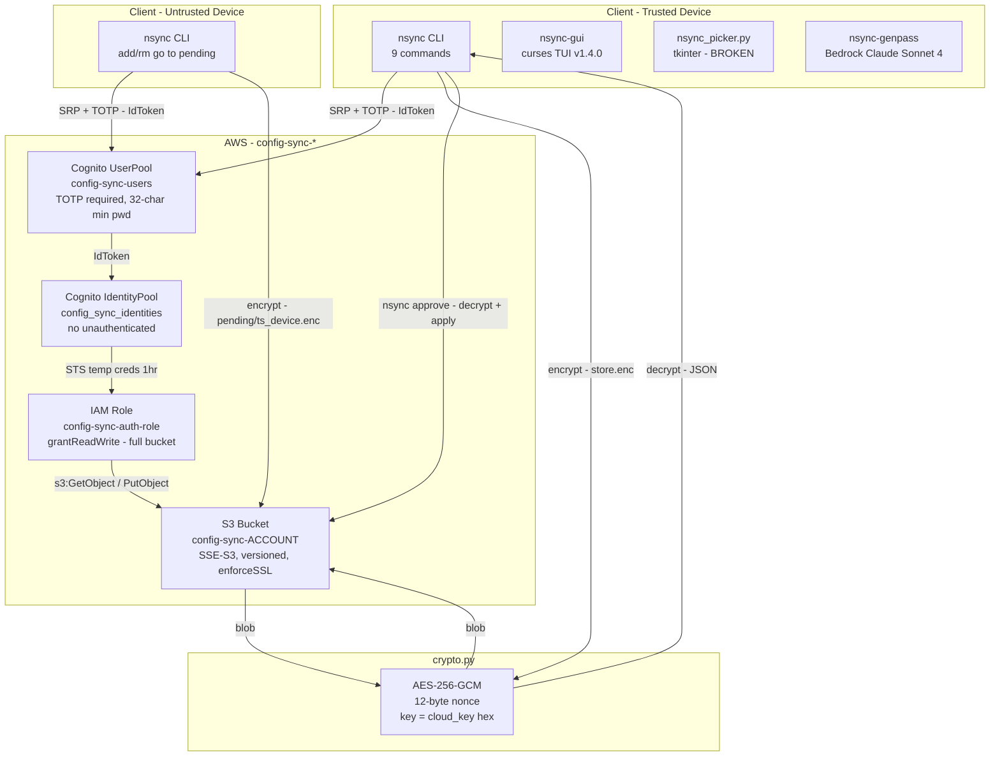
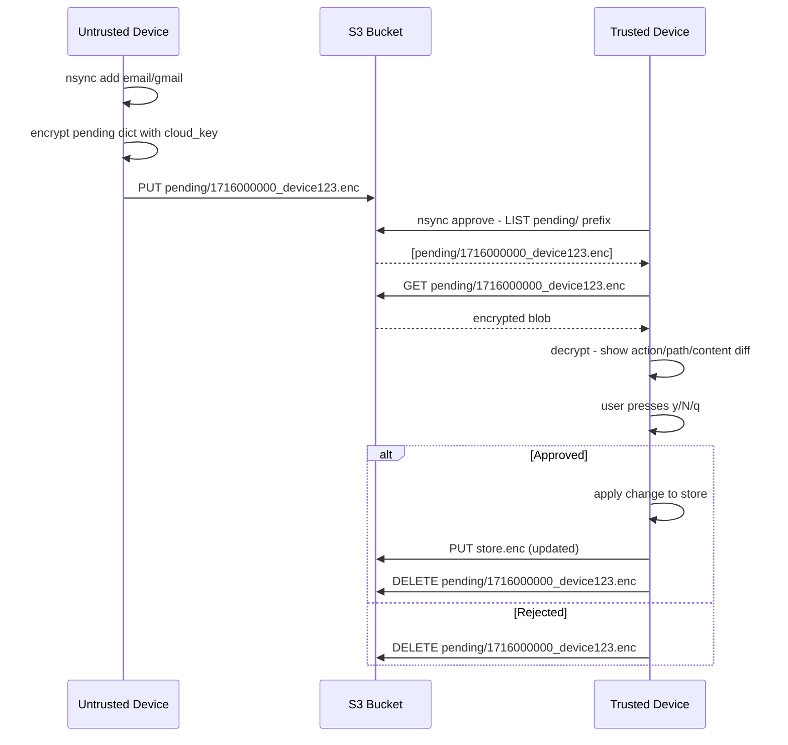
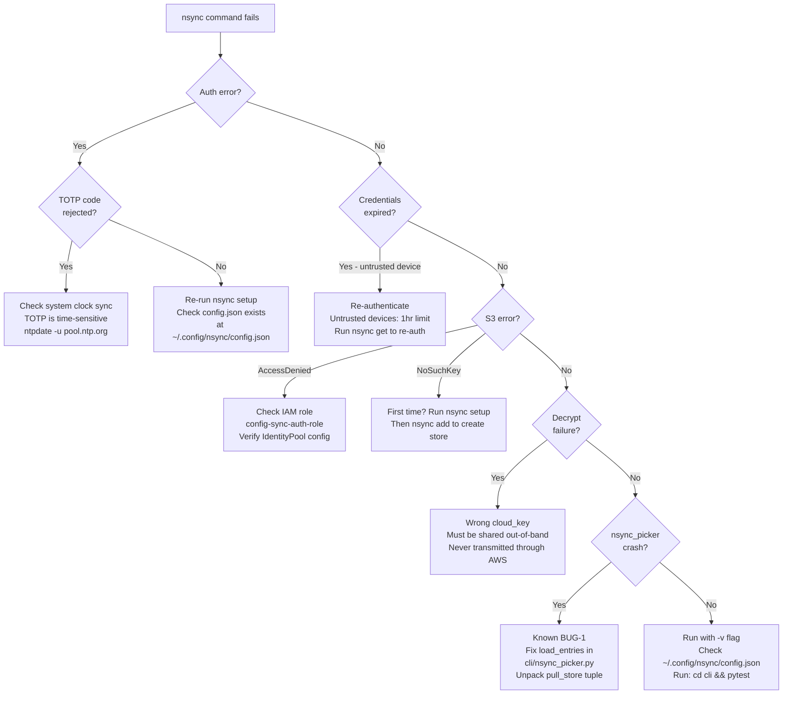

# secure-notes-sync Enhancement Report

**Investigation ID:** 6a22ad8d | **Date:** 2026-05-24 | **Model:** claude-sonnet-4.6-1m

---

## Executive Summary

The `secure-notes-sync` (nsync) project is a well-architected personal password manager using AES-256-GCM client-side encryption, Cognito SRP+TOTP authentication, and temporary STS credentials for S3 access. The current agent prompt (~1344 chars) covers only the skeleton — direct source inspection revealed **1 active crash bug**, **2 security gaps**, **1 hardcoded region**, and **8+ missing prompt items** that would cause the agent to give incorrect guidance or miss entire subsystems. The most critical finding is that `nsync_picker.py` (the Spotlight-launchable GUI) crashes immediately on launch due to a tuple unpacking bug. All AWS resources use deliberate stealth naming (`config-sync-*`) to avoid drawing attention in the AWS console.

---

## Architecture Overview



---

## CLI Commands Reference

| Command | Flags | Trusted Only | Notes |
|---------|-------|:---:|-------|
| `setup` | — | — | Interactive first-time setup, caches refresh token |
| `get <path>` | `-c` clipboard 45s auto-clear, `-t` type via AppleScript/xdotool | — | |
| `add <path>` | `-f` force overwrite | No | Untrusted → pending/ |
| `rm <path>` | — | No | Untrusted → pending/ |
| `ls` | — | — | Requires cloud_key |
| `pull` | — | — | Shows entry count + last modified |
| `approve` | — | **YES** | Interactive review of pending/ objects |
| `rotate-key` | — | **YES** | Re-encrypts store with new key |
| `import-pass` | — | **YES** | Walks `~/.password-store`, decrypts all .gpg |

### Install & Deploy

```bash
# Install CLI
cd cli && pip install -e .

# Deploy infrastructure
cd infra && npm install && npx cdk deploy

# Run tests
cd cli && pytest
```

---

## Approval Workflow — Sequence Diagram



---

## CDK Infrastructure

| Resource | Name | Key Settings |
|----------|------|-------------|
| Cognito UserPool | `config-sync-users` | TOTP required, no SMS, no self-signup, 32-char min pwd, no account recovery, RETAIN |
| App Client | `config-sync-cli` | SRP auth, no secret, 1hr access/id tokens, 3650-day refresh |
| S3 Bucket | `config-sync-{account}` | SSE-S3, versioned, RETAIN, enforceSSL, BlockPublicAccess.BLOCK_ALL |
| Identity Pool | `config_sync_identities` | No unauthenticated identities |
| IAM Role | `config-sync-auth-role` | `bucket.grantReadWrite(authRole)` — full bucket |

> **Stealth naming:** All AWS resources use `config-sync-*` prefix intentionally — not `nsync-*` or `password-*`.

---

## Active Bug — CRITICAL

### BUG-1: nsync_picker.py crashes on launch (TypeError)

**File:** `cli/nsync_picker.py` → `load_entries()`

```python
# BROKEN — sync.pull_store returns (dict|None, str|None) tuple
def load_entries():
    cfg = config.load()
    creds = auth.authenticate(cfg)
    remote = sync.pull_store(creds, cfg)   # returns TUPLE, not dict
    if remote is None:                      # tuple is never None
        return {}
    return remote["entries"]               # TypeError: tuple indices must be integers
```

```python
# FIX — unpack the tuple
def load_entries():
    cfg = config.load()
    creds = auth.authenticate(cfg)
    remote, _etag = sync.pull_store(creds, cfg)
    if remote is None:
        return {}
    return remote["entries"]
```

**Impact:** The Spotlight-launchable tkinter GUI is completely non-functional.

---

## Security Gaps

### SEC-1 — IAM Role: Full Bucket Access

```typescript
// CURRENT — grants s3:* on entire bucket
bucket.grantReadWrite(authRole);

// HARDENED — restrict to specific prefixes
bucket.addToResourcePolicy(new iam.PolicyStatement({
  principals: [authRole],
  actions: ["s3:GetObject", "s3:PutObject", "s3:DeleteObject"],
  resources: [bucket.arnForObjects("store.enc"), bucket.arnForObjects("pending/*")],
}));
```

### SEC-2 — nsync-gui: Auto-Update Without Signature Verification

```python
# CURRENT — writes raw GitHub content with no integrity check
with open(script_path, "w") as f:
    f.write(self.update_content)
os.chmod(script_path, 0o755)

# FIX — verify SHA-256 before writing
import hashlib
EXPECTED_SHA256 = "<pinned-commit-hash>"
if hashlib.sha256(content.encode()).hexdigest() != EXPECTED_SHA256:
    raise ValueError("Update integrity check failed")
```

### SEC-3 — crypto.py: No Authenticated Associated Data (AAD)

```python
# CURRENT — ciphertext not bound to S3 key context
ct = AESGCM(bytes.fromhex(key_hex)).encrypt(nonce, data, None)

# FIX — bind ciphertext to its S3 location
ct = AESGCM(bytes.fromhex(key_hex)).encrypt(nonce, data, s3_key.encode())
```

---

## Other Gaps

| ID | Gap | Severity | Fix |
|----|-----|:--------:|-----|
| GAP-2 | `nsync-genpass` hardcodes `region_name='us-west-2'` for Bedrock | Medium | Use `cfg['region']` |
| GAP-3 | `pass-nsync.bash` runs full `import-pass` on every change | Low | Delta-sync approach |
| GAP-4 | `push_store` ignores ETag — silent race condition on concurrent writes | Medium | Use `If-Match: <etag>` on PutObject |

### Fix GAP-4 — Conditional Write

```bash
# S3 conditional write — fails if ETag changed since last pull
aws s3api put-object --bucket <BUCKET_NAME> --key store.enc --body store.enc --if-match <ETAG>
```

---

## Troubleshooting Decision Tree



---

## Scripts Inventory

| Script | Location | Purpose | Known Issues |
|--------|----------|---------|-------------|
| `nsync-gui` | `scripts/` | Curses TUI v1.4.0 — live search, pending approvals | Auto-update without sig verification (SEC-2) |
| `nsync-genpass` | `scripts/` | Bedrock Claude Sonnet 4 password generation | Hardcoded `us-west-2` (GAP-2) |
| `nsync-type.sh` | `scripts/` | fzf fuzzy picker + xdotool type-out | — |
| `nsync_picker.py` | `cli/` | tkinter GUI, Spotlight-launchable | **BROKEN** — BUG-1 |
| `pass-nsync.bash` | `cli/` | pass wrapper, auto-syncs on change | Full re-import on every change (GAP-3) |
| `generate-setup.sh` | `cli/` | Generates copy-paste setup commands | — |

---

## Store Format

```json
{
  "version": 1,
  "entries": { "email/gmail": "password123" },
  "metadata": { "last_modified": "2026-05-24T21:00:00Z", "modified_by": "device_id" },
  "history": {
    "email/gmail": [
      { "value": "old_password", "replaced_at": "2026-05-01T10:00:00Z", "replaced_by": "device_id" }
    ]
  }
}
```

- S3 key: `store.enc` (single encrypted blob)
- Path validation: `^[a-zA-Z0-9][a-zA-Z0-9/_@.+-]*$` + no `..`
- Wire format: `nonce(12 bytes) || ciphertext+tag`

---

## Config File

- **Location:** `~/.config/nsync/config.json`
- **Permissions:** `0o600` (file), `0o700` (directory)
- **Contains:** region, user_pool_id, client_id, identity_pool_id, bucket, username, device_password (64-char), cloud_key (hex), refresh_token, device_id, trusted (bool), auth_timestamp

> **Critical:** `cloud_key` must be shared out-of-band to new devices — it is **never** transmitted through AWS.

---

## Recommended Action Plan

| Priority | Action | File | Effort |
|:--------:|--------|------|:------:|
| P1 | Fix BUG-1: unpack `pull_store` tuple | `cli/nsync_picker.py` | 1 line |
| P2 | Scope IAM role to `store.enc` + `pending/*` | `infra/lib/stack.ts` | ~10 lines |
| P2 | Add update signature verification to nsync-gui | `scripts/nsync-gui` | ~5 lines |
| P2 | Add AAD to crypto.py | `cli/nsync/crypto.py` | 2 lines |
| P3 | Fix nsync-genpass hardcoded region | `scripts/nsync-genpass` | 1 line |
| P3 | Add conditional write (If-Match ETag) to push_store | `cli/nsync/sync.py` | ~5 lines |
| P4 | Replace agent prompt with enhanced version | agent config | — |

---

## Enhanced Agent Prompt

```json
{
  "name": "secure-notes-sync-agent",
  "description": "Specialized agent for secure-notes-sync (nsync) — encrypted notes sync via AWS",
  "prompt": "You are a specialized developer for the secure-notes-sync (nsync) project.\n\nProject: ~/work/github/secure-notes-sync/\nLanguage: Python (CLI) + TypeScript (CDK infrastructure)\nPurpose: Sync encrypted notes/passwords across devices using AWS. Zero-trust — AWS never sees plaintext. TOTP-only auth.\n\n## Key Directories\n- cli/nsync/: Core modules (cli.py, crypto.py, auth.py, store.py, sync.py, config.py)\n- cli/tests/: pytest test suite (545 lines, run: cd cli && pytest)\n- infra/lib/stack.ts: CDK stack (single file)\n- scripts/: nsync-gui, nsync-genpass, nsync-type.sh\n- cli/: nsync_picker.py, pass-nsync.bash, generate-setup.sh\n\n## CLI Commands (9 total)\n- setup: First-time setup, caches refresh token\n- get <path> [-c clipboard 45s auto-clear] [-t type via AppleScript/xdotool]\n- add <path> [-f force] — stdin or getpass; untrusted devices → pending\n- rm <path> — untrusted devices → pending\n- ls — list all entry paths\n- pull — show store metadata\n- approve — review/apply pending changes (TRUSTED ONLY)\n- rotate-key — re-encrypt store with new key (TRUSTED ONLY)\n- import-pass — import ~/.password-store (TRUSTED ONLY)\n\n## Architecture\n- S3: single AES-256-GCM encrypted blob (store.enc); pending changes at pending/{ts}_{device}.enc\n- Cognito UserPool 'config-sync-users': TOTP MFA required, SRP auth, no self-signup, 32-char min pwd\n- App client 'config-sync-cli': 1hr access/id tokens, 3650-day refresh token (trusted), 1hr enforced (untrusted)\n- IdentityPool → temporary STS credentials (1hr) for all S3 operations\n- Config: ~/.config/nsync/config.json (0o600), dir 0o700\n- Stealth naming: all AWS resources use 'config-sync-*' prefix, not 'nsync-*'\n\n## Encryption\n- AES-256-GCM via cryptography.hazmat; key = 256-bit hex in config\n- Wire format: nonce(12 bytes) || ciphertext+tag\n- Store format: JSON {version, entries{path:value}, metadata, history}\n- Path validation: regex ^[a-zA-Z0-9][a-zA-Z0-9/_@.+-]*$ + no '..'\n- Version history: previous values saved on overwrite\n\n## Auth Flow\nSRP → PASSWORD_VERIFIER challenge → SOFTWARE_TOKEN_MFA challenge → IdToken\n→ cognito-identity.get_id → get_credentials_for_identity → {AccessKeyId, SecretKey, SessionToken}\nRefresh token cached in config; untrusted devices: auth_timestamp enforced, cleared after 1hr\n\n## Known Bugs\n- nsync_picker.py: load_entries() treats pull_store() result as dict; pull_store returns (dict, etag) tuple → TypeError on launch\n- nsync-genpass: hardcodes region_name='us-west-2' for Bedrock\n\n## Security Gaps\n- IAM role uses bucket.grantReadWrite(authRole) — full bucket, no path restriction\n- nsync-gui auto-update writes raw GitHub content without hash/signature verification\n- crypto.py passes None as AAD — ciphertext not bound to S3 key context\n\n## Critical Rules\n- NEVER store or log plaintext notes or the cloud_key\n- NEVER disable TOTP MFA requirement\n- Encryption happens client-side ONLY — server never sees plaintext\n- AES-256-GCM with unique nonce per encryption\n- Trusted device changes apply immediately; untrusted device changes go to pending/ for approval\n- The cloud_key must be shared out-of-band to new devices — never transmitted through AWS"
}
```

---

## References

| Source | Contribution |
|--------|-------------|
| `cli/nsync/crypto.py` | AES-256-GCM implementation, nonce format, AAD gap |
| `cli/nsync/auth.py` | SRP+TOTP flow, refresh token handling, trusted/untrusted logic |
| `cli/nsync/sync.py` | pull_store tuple return type (source of BUG-1), push_store ETag gap |
| `cli/nsync/store.py` | Store JSON format, path validation, version history |
| `cli/nsync/config.py` | Config file location, permissions, fields |
| `cli/nsync_picker.py` | BUG-1 confirmed |
| `infra/lib/stack.ts` | CDK resources, stealth naming, IAM scope gap |
| `scripts/nsync-gui` | Auto-update without signature verification (SEC-2) |
| `scripts/nsync-genpass` | Hardcoded us-west-2 region (GAP-2) |
| AWS Docs — Cognito | SRP auth flow, TOTP MFA, Identity Pool credentials |
| AWS Docs — S3 | Conditional writes (If-Match), SSE-S3 vs KMS tradeoffs |
